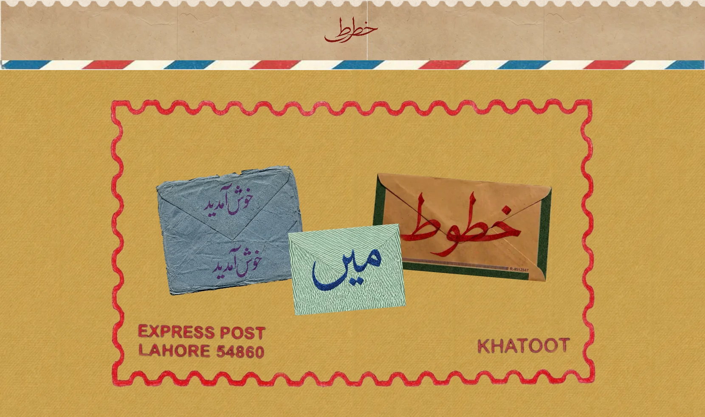
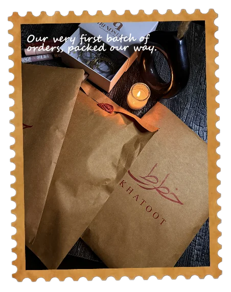
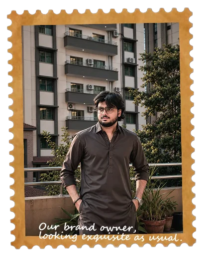
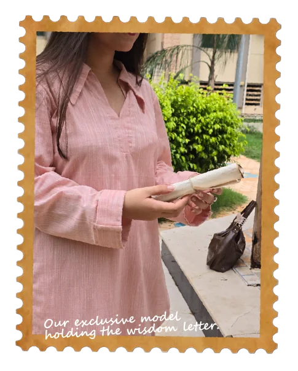
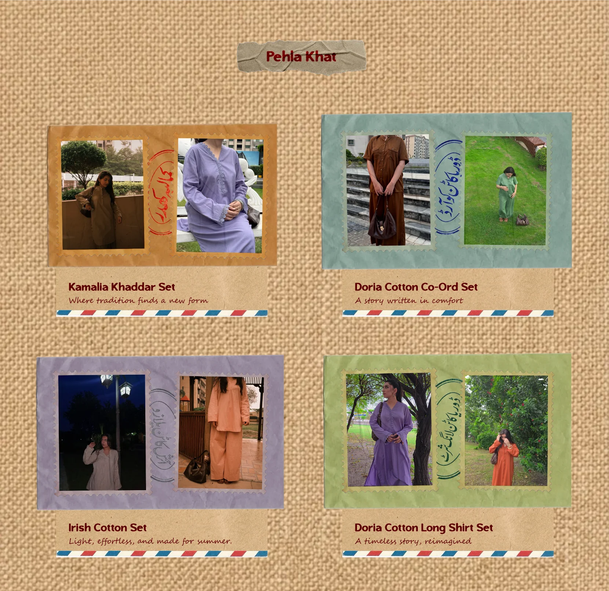
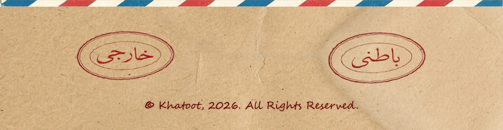

<p align="center">
  
</p>

<p align="center">
  Khatoot is an independent neo-cultural clothing brand from Lahore, Pakistan.<br>
  This repository is its website: the storefront for <b>Pehla Khat</b>, the brand’s first collection.
</p>

<p align="center">
  
</p>

<picture>
  <source media="(prefers-color-scheme: dark)" srcset=".github/readme/h-name-dark.webp">
  
</picture>



Khatoot derives from the word “Khat” in Urdu, which translates to letters. Our goal is to convey a story through our clothing personalized to whoever feels inspired enough to wear our love. What better way to convey it than through letters?

<br clear="left">

<picture>
  <source media="(prefers-color-scheme: dark)" srcset=".github/readme/h-origins-dark.webp">
  
</picture>



Khatoot was started as an independent neo-cultural brand by Ahmad Zafar, right in the heart of Pakistan, Lahore. Our brand aims to blend the concept of letters and envelopes with hand-woven, top-notch quality clothing that’s both personalized and heart-warming.

<br clear="right">

<picture>
  <source media="(prefers-color-scheme: dark)" srcset=".github/readme/h-craft-dark.webp">
  
</picture>



We only believe in crafting our designs from exquisite and hand-woven material. Hence, we have designed our clothes in Kamalia Khaddar, Doria Cotton, Irish Cotton, and more.

<br clear="left">

<p align="center">
  
</p>

<p align="center">
  
</p>

<picture>
  <source media="(prefers-color-scheme: dark)" srcset=".github/readme/h-built-dark.webp">
  
</picture>

A React single-page app with a headless Shopify backend. Shopify holds the products, prices, cart and checkout; the site is the letter they arrive in.

- **React 19 + Vite** for the app and build, **React Router 7** for routing
- **Shopify Storefront API** (GraphQL) for live prices, the cart and checkout. The cart ID is kept in `localStorage`, and *Buy Now* or the checkout tag hand off to Shopify’s own checkout.
- **Plain CSS**, one stylesheet per component, no UI library
- **Hand-made artwork** in `resources/`, exported as WebP
- **Vercel**, with `vercel.json` rewriting every path to `index.html` so routes survive a refresh

| Route | Page |
| --- | --- |
| `/` | Landing stamp and the Pehla Khat collection |
| `/product/pehla-khat/:id` | A single piece: photos, size, quantity, and checkout |
| `/cart` | The cart, with each piece written on a postcard |
| `/about` | The brand’s story |
| anything else | A “still working on this” page |

<picture>
  <source media="(prefers-color-scheme: dark)" srcset=".github/readme/h-running-dark.webp">
  
</picture>

You’ll need Node.js 20.19+ (or 22.12+) and a Shopify store with a Storefront API access token.

```bash
npm install
```

Create a `.env.local` file in the project root (it’s git-ignored):

```bash
VITE_SHOPIFY_DOMAIN=your-store.myshopify.com
VITE_SHOPIFY_STOREFRONT_TOKEN=your-storefront-access-token
```

Then start the dev server:

```bash
npm run dev
```

| Command | What it does |
| --- | --- |
| `npm run dev` | Starts the dev server with hot reload |
| `npm run build` | Builds the production site into `dist/` |
| `npm run preview` | Serves the production build locally |
| `npm run lint` | Runs ESLint |

Products are listed in `src/PehlaKhatDetails.js`. Each entry’s `variantId` must match a variant in your Shopify store, or its price won’t load and it can’t be added to the cart.

<picture>
  <source media="(prefers-color-scheme: dark)" srcset=".github/readme/h-design-dark.webp">
  
</picture>

- **One artboard, scaled.** The desktop layout was designed on a 1536px canvas. `--u` in `src/Main.css` equals one pixel of that canvas, and every size is written as `calc(N * var(--u))`, so the whole page scales with the window.
- **Re-flowed below 900px.** On tablets and phones `--u` is re-based so the same type stays readable, and each component stacks in its own media query. Phones get a hamburger menu whose strokes run through an SVG ink-bleed filter to match the lettering.
- **The airmail border.** On narrow pages the striped border is drawn with `border-image`, so the stripes repeat along each edge instead of stretching.
- **Type.** Headings are set in Malevice Inkbleed, bundled in `resources/`. Handwritten lines use Segoe Script, which is a Windows system font, so other platforms fall back to a default face.

<p align="center">
  <br>
  Khatoot was founded by Ahmad Zafar in Lahore.<br>
  Website designed and built by Ahmed Hassnain.
</p>

<p align="center">
  
</p>
